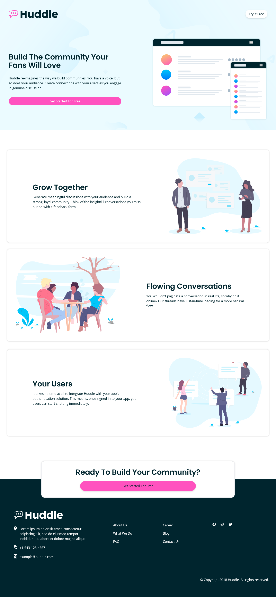
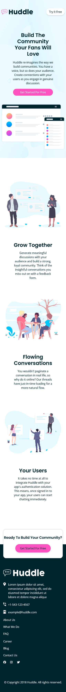

# Frontend Mentor - Huddle landing page with alternating feature blocks solution

This is a solution to the [Huddle landing page with alternating feature blocks challenge on Frontend Mentor](https://www.frontendmentor.io/challenges/huddle-landing-page-with-alternating-feature-blocks-5ca5f5981e82137ec91a5100). Frontend Mentor challenges help you improve your coding skills by building realistic projects. 

## Table of contents

- [Overview](#overview)
  - [The challenge](#the-challenge)
  - [Screenshot](#screenshot)
  - [Links](#links)
- [My process](#my-process)
  - [Built with](#built-with)
  - [What I learned](#what-i-learned)
  - [Continued development](#continued-development)
  - [Useful resources](#useful-resources)
- [Author](#author)
- [Acknowledgments](#acknowledgments)


## Overview
---

This is a landing page designed by fontend mentor . It improve to make layout  easier and enhance design pattern.This is a simple 

### The challenge

Users should be able to:

- View the optimal layout for the site depending on their device's screen size
- See hover states for all interactive elements on the page

### Screenshot


Desktop design
---



Mobile design
---




### Links


- Solution URL: [sorce code](https://github.com/rashed-mia/huddle-landing-page.git)
- Live Site URL: [ live site URL](https://huddle-landing-page-gamma-virid.vercel.app/)

## My process
---

I have completed this challenge on my vs code and have used build tool vite to implement this project.

Then push source code on github and deploy on vercel.

### Built with


- Semantic HTML5 markup
- CSS custom properties
- Tailwind css
- Flexbox
- CSS Grid
- Mobile-first workflow
- vite

### What I learned
---

I have learned how to use CSS Grid to position the content and create a responsive layout. I have also learned how to use CSS Flex to create a responsive layout. I have also learned how to use JavaScript to dynamically populate the content from the local JSON data. I have also learned how to use CSS transitions to create smooth animations on hover and focus states.

 see some snippet below:

``` 
Tailwind css

  <div
        class="container mx-auto flex max-sm:flex-col justify-between max-sm:space-y-12 py-12 px-2"
      >
        <div
          class="flex flex-col justify-center items-center sm:items-start max-sm:w-[70%] max-sm:mx-auto max-sm:text-center lg:space-y-6 sm:pr-3"
        >
          <h1
            class="xl:w-[80%] font-poppines font-bold xl:font-extrabold text-3xl sm:text-2xl xl:text-4xl"
          >
            Build The Community Your Fans Will Love
          </h1>
          <p class="xl:w-[80%] font-normal max-sm:py-5 sm:py-2">
            Huddle re-imagines the way we build communities. You have a voice,
            but so does your audience. Create connections with your users as you
            engage in genuine discussion.
          </p>
          <button
            class="xl:w-[80%] max-sm:w-[90%] bg-primary px-4 py-2 rounded-full text-white active:bg-primaryActive"
          >
            Get Started For Free
          </button>
        </div>
        <div class="">
          
        </div>
      </div>
```


### Useful resources

- [www.w3school.com](https://www.w3school.com) - This helped me for simple html and css  tutorial. I really liked this pattern and will benifited any beginner to going forward.
- [kevin powell](https://www.youtube.com/@KevinPowell) - This is an amazing youtube chanel which helped me finally understand css styling. I'd recommend it to anyone still learning this concept.


## Author

- Website - [Rashed Mia](https://web-develop-kickstart-2.vercel.app/)
- Frontend Mentor - [@rashed-mia](https://www.frontendmentor.io/profile/rashed-mia)
- Twitter - [Rashed Mia](https://x.com/RashedM17428627)


## Acknowledgments
youtube is the best video tutorial platform to learn web devolopment. Otherwise bengli community helps me alot to solve my problem. I am very thankful to them. [learn-with-sumit](https://learnwithsumit.com/), [programming hero](https://web.programming-hero.com/home) and [tapas-adhikary](https://www.youtube.com/@tapascript-bangla)
